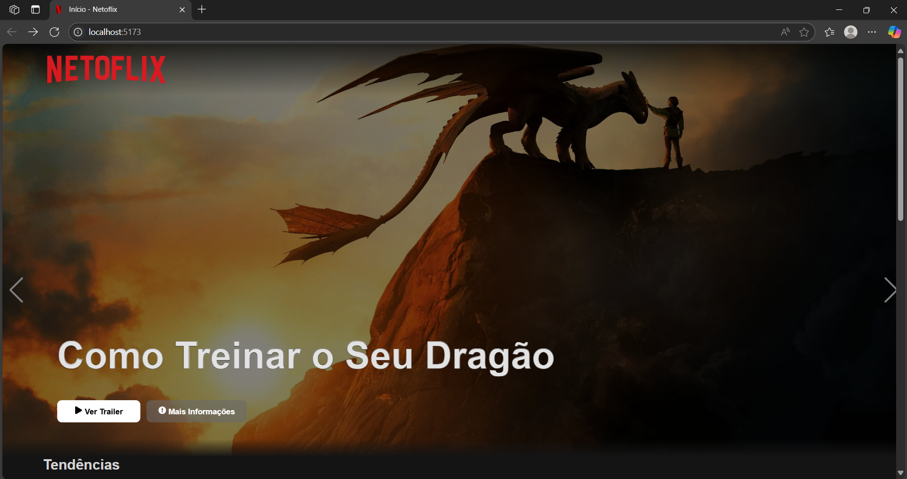
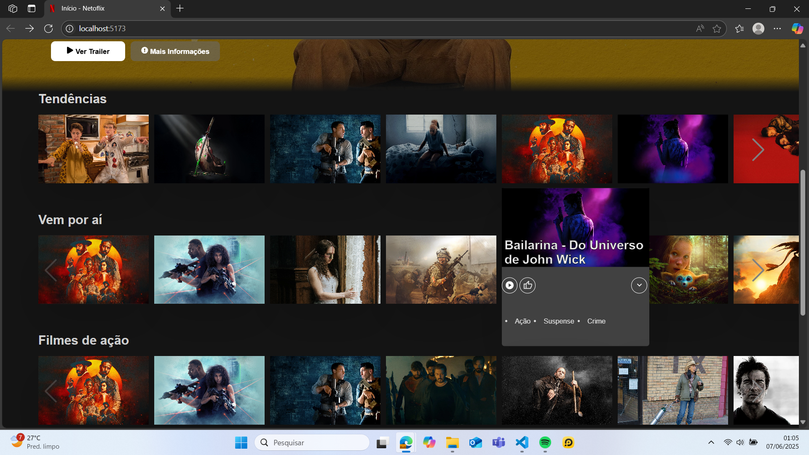
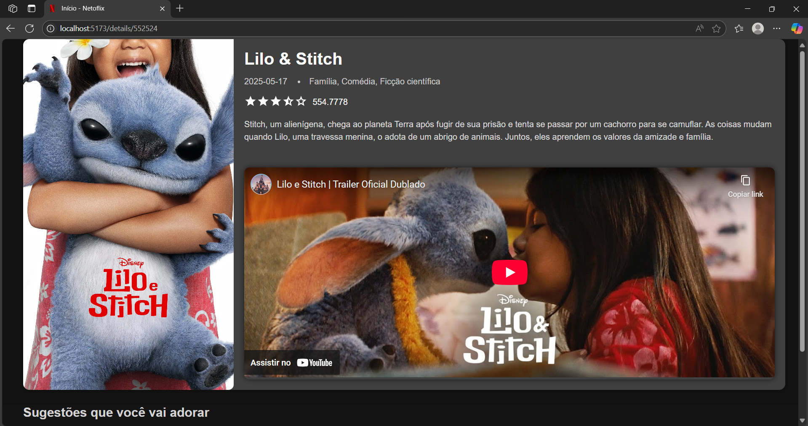

# 🎬 Netoflix


> Projeto iniciado em sala de aula com o intuito de replicar uma plataforma de streaming(Netflix).

## 🚀 Tecnologias

- React
- React Router
- CSS 
- Swiper
- TMDB API 

## 📸 Preview

## Home


---
## Cards


---
## Página de detalhes


---

## 🔧 Como rodar localmente

```bash
# Clone o repositório
git clone https://github.com/rdavila-mesquita/Netoflix.git

# Entre na pasta
cd nome-da-pasta

# Instale as dependências
npm install

# Inicie o servidor de desenvolvimento
npm run dev
